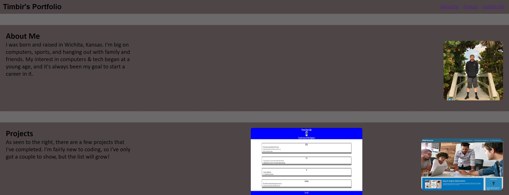

## Usage

View the deployed portfolio on GitPages or simply look at the code.

Images under the Projects section all have hyperlinks.

Each section under the navigation bar will take you to the respective section.

## Screenshots

## Table of Contents

About Me: Personal information about the coder.

Projects: Projects that the coder has deployed.

Contact Info: Different ways to get in contact with the coder.

## Sources

Tabnine - VSCode extension.

Dylan Osborn - Fellow Student

Andrew Hudgins - TA

W3schools.com - For information on media queries and flexbox.